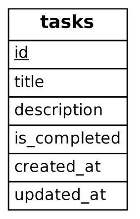

# Getting Started
First, let's create a Todo application to understand the flow of Laravel processing.  
In this chapter, you will experience the following
1. creating Migration
2. creating Model(Eloquent) 
3. Creating Routing 
4. Request creation 
5. Controller creation 
6. View creation

# Data Structure
In this case, only one Table will be created for the purpose of minimal task management.  

The table will be created following the Active Record pattern to maximize the effectiveness of the Eloquent Model.

Translated with www.DeepL.com/Translator (free version)