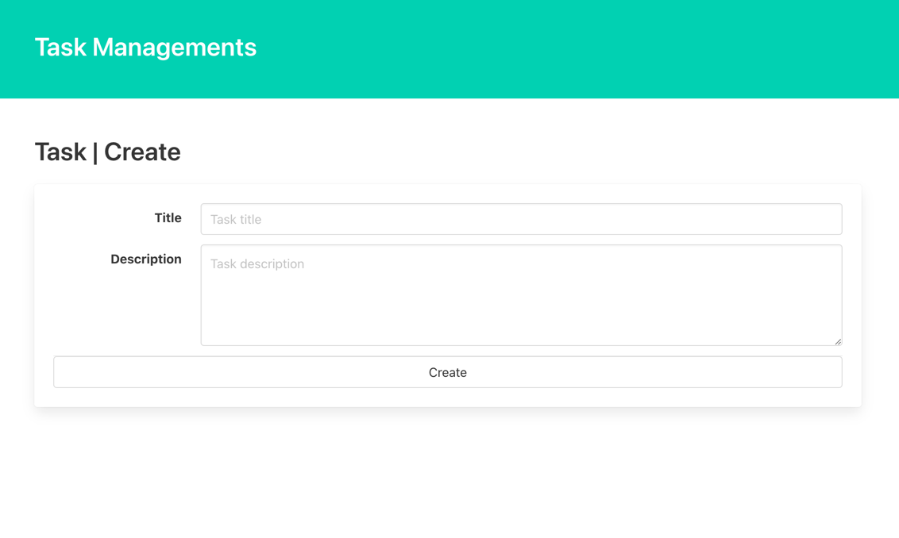

# Introduction
So far, we have explained each Laravel feature such as Migration and Model.  
Now that the preliminary work is done, let's get on with the REST design and create a CRUD process.  
https://readouble.com/laravel/9.x/ja/controllers.html#actions-handled-by-resource-controller  
Let's use the above as a reference to create the Tasks resource process.

CRUD is an acronym for the following and let's develop accordingly.
- Create
- Read
- Update
- Delete

# Create Controller
In general Laravel development, a Controller is created to divide routing and processing.  
Depending on the project, the hierarchy may be further subdivided, but in this case, we will describe all the logic in the Controller.  
https://readouble.com/laravel/9.x/ja/controllers.html

Create a Controller with the following command.
This time, we will use the `resource` option to take over the REST design.
```
./vendor/bin/sail exec laravel.test php artisan make:controller TaskController --resource
```

If successful, `./app/Http/Controller/TaskController.php` will be created.

# Create Routing
Next, create the Endpoint.  
In the existing file, `./routes/web.php`.
Let's add two routings, one for the Create screen and one for the Create process.  
This will allow API access.
```
Route::get('tasks/create', [\App\HttpControllers\TaskController::class, 'create'])->name('tasks.create');
Route::post('tasks', [\App\HttpControllers\TaskController::class, 'store'])->name('tasks.store');
```
The name method allows you to name the routing.  
By specifying this, route helper can be used to generate URLs by route name.  

# Create View
Let's create a Create screen.  
Since we are not using JS this time, let's use Laravel's template engine called blade.  
https://readouble.com/laravel/9.x/ja/blade.html  
To my surprise, there is no command for creating a page (even though there is a component). (Even though there is a component...) .  

`./resources/views/task/create.blade.php` manually and copy the following.  

```
<!DOCTYPE html>
<html lang="{{ str_replace('_', '-', app()->getLocale()) }}">
<head>
    <meta charset="utf-8">
    <title>Laravel</title>
    <link rel="stylesheet" href="https://cdn.jsdelivr.net/npm/bulma@0.9.4/css/bulma.min.css">
</head>
<body>
<section class="hero is-primary">
    <div class="hero-body">
        <p class="title">
            Task Managements
        </p>
    </div>
</section>
@if($errors->any())
    <div class="notification is-danger">
        <button class="delete"></button>
        <ul>
            @foreach(\Illuminate\Support\Arr::flatten($errors->get('*')) as $message)
                <li>{{ $message }}</li>
            @endforeach
        </ul>
    </div>
@endif
<section class="section">
    <h1 class="title">Task | Create</h1>
    <form method="post" action="{{ route('tasks.store') }}">
        @csrf
        <div class="card">
            <div class="card-content">
                <div class="field is-horizontal">
                    <div class="field-label is-normal">
                        <label class="label" for="title">Title</label>
                    </div>
                    <div class="field-body">
                        <div class="field">
                            <p class="control">
                                <input id="title" name="title" class="input" type="text" placeholder="Task title">
                            </p>
                        </div>
                    </div>
                </div>

                <div class="field is-horizontal">
                    <div class="field-label is-normal">
                        <label class="label" for="description">Description</label>
                    </div>
                    <div class="field-body">
                        <div class="field">
                            <div class="control">
                                <textarea id="description" name="description" class="textarea"
                                          placeholder="Task description"></textarea>
                            </div>
                        </div>
                    </div>
                </div>

                <footer class="card-footer">
                    <button type="submit" class="card-footer-item button">Create</button>
                </footer>
            </div>
        </div>
    </form>
</section>
</body>
</html>
```

BULMA is used as CSS FW.  
We do not deal with the details of HTML and CSS, so if you are interested, please check the official website.  
https://bulma.io/

# Edit Controller@create
Add the following to TaskController.  
This will cause the created View to be returned when this endpoint is accessed.
```
public function create()
{
    return view('task.create');
}
```

Now, with the implementation so far, we can see the screen.  
Let's access it and take a look.  
[task.create screen](http://localhost/tasks/create)  


# Create FormRequest
Next, let's create the save process.  
In Laravel, validation can be done in the FormRequest before entering the Controller.  
Let's create it as soon as possible.  
```
./vendor/bin/sail exec laravel.test php artisan make:request Task/StoreRequest
```
./app/Http/Requests/Task/StoreRequest.php will be created.

Before setting the validation rule, first change it to `return true` as shown below.
It is possible to authenticate each Request individually.
If this is false, it will be treated as an authentication failure.
```
public function authorize()
{
    return true;
}
```

# Create Validation Rule
ValidationRule can be found at  
https://readouble.com/laravel/9.x/ja/validation.html

In this case, we will set the Rule to title and description, according to the DB design.
``` 
return [
    'title' => ['required', 'string', 'max:255'],
    'description' => ['required', 'string', 'max:1024'],
];
```
Laravel implements many validations.  
Let's use a combination of them according to your requirements.

## Create Controller@store
## Injection of FormRequest
Make a `Dependency Injection` of the StoreRequest you just created to a method of Controller.  
Be sure to use the execution path of the StoreRequest.
By doing so, FormValidation will be executed at the timing when the Controller action is executed.
``` 
public function store(StoreRequest $request)
```
Once the above has been set up, let's move to the task creation screen and press Create with an empty screen.  
This should display the validation error correctly.  
[Task creation screen](http://localhost/tasks/create)  
  

## Registration process to DB
In Laravel, DB registration can be easily done via Eloquent.  
Please refer to the following code.  
```
public function store(StoreRequest $request)
{
    $task = DB::transaction(fn() => Task::create($request->validated())));

    return response()->json($task);
}
```

This code does the following  
1. start a DB transaction
2. execute RecordCreate using Eloquent in the closure
3. $request->validated() returns only the parameters that passed the ValidationRule of the retrieved FormRequest. 4.  
4. store the execution result in $task
5. create response as json as a temporary process

After setting up this code, set the Title and Description from the screen and register the task.  
[Task creation screen](http://localhost/tasks/create)  
  
This screen is displayed as formatted by Chrome's Plugin.  
If the registration result is displayed with Simple text, it is successful.  

# Conclusion
In this chapter, we implemented Laravel's create/store process.  
In the next chapter, we will create index/show as a read process so that we can check this created data.  

