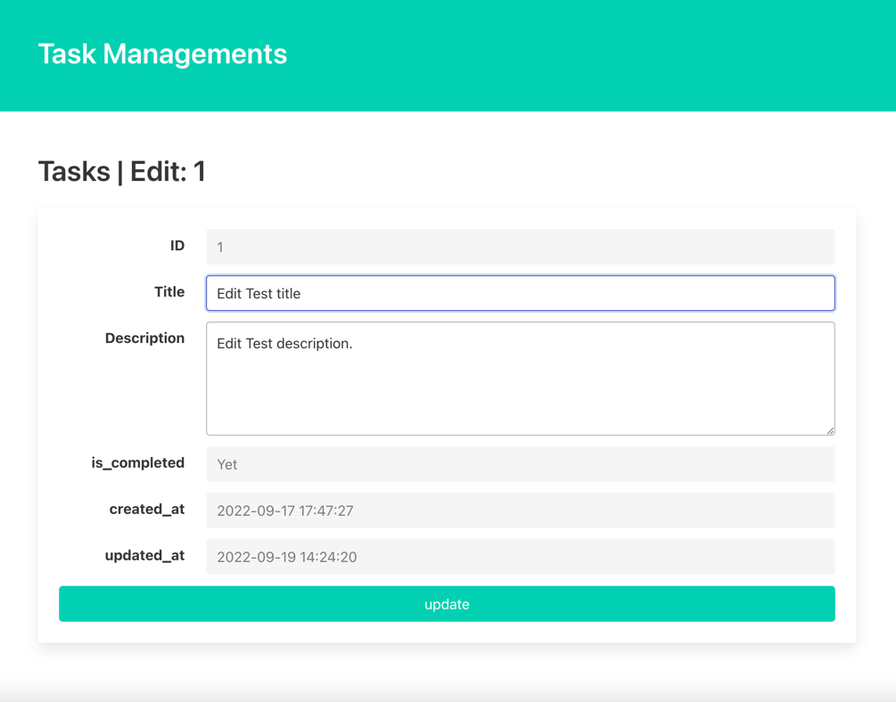
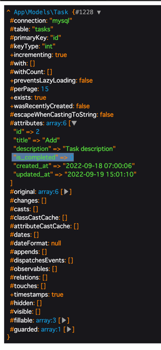

# Introduction
In this chapter, we will create edit, update, and complete(yetComplete) methods as Update processes.  
Each of these is created for the following purposes
- edit: Display the update screen
- update: Execute the update process
- complete: Implement update with is_completed set to true
- yetComplete: Implement update with is_completed false

# Create Routing
Define routing for edit and update according to the Restfull design.
```
Route::get('tasks/{task}/edit', [\App\HttpControllers\TaskController::class, 'edit'])->name('tasks.edit');
Route::put('tasks/{task}', [\App\Http\Controllers\TaskController::class, 'update'])->name('tasks.update');
```
complete(yetComplete) is created separately because it deviates from the Restfull design.

# Create Request
Create a Request for Update.  
Create the corresponding file with the following command.
``` 
./vendor/bin/sail exec laravel.test php artisan make:request Task/UpdateRequest
```

In the update screen, the target items are the same as in Store because the completion status management is disabled.  
Please complete the FormValidation by referring to StoreRequest.  

## Create Controller
## edit 
The processing here is almost identical to the show method.  
An example implementation is provided in the src below, but first, let's see how you implement it yourself.

## update
update can be implemented by calling the update method from EloquentModel.  
Be sure to execute Transaction to prepare for the possibility of update failure.
```
public function update(UpdateRequest $request, Task $task)
{
    DB::transaction(fn() => $task->update($request->validated())));

    return to_route('tasks.index');
}
```

# Create view
Create the edit screen.  
Also, since the transition from show to edit is not yet realized, let's modify the code so that it can be done.  

## edit 

``` 
<!DOCTYPE html>
<html lang="{{ str_replace('_', '-', app()->getLocale()) }}">
<head>
    <meta charset="utf-8">
    <title>Laravel</title>
    <link rel="stylesheet" href="https://cdn.jsdelivr.net/npm/bulma@0.9.4/css/bulma.min.css">
</head>
<body>
<section class="hero is-primary">
    <div class="hero-body">
        <p class="title">
            Task Managements
        </p>
    </div>
</section>
@if($errors->any())
    <div class="notification is-danger">
        <button class="delete"></button>
        <ul>
            @foreach(\Illuminate\Support\Arr::flatten($errors->get('*')) as $message)
                <li>{{ $message }}</li>
            @endforeach
        </ul>
    </div>
@endif
<section class="section">
    <h1 class="title">Tasks | Edit: {{ $task->id }}</h1>
    <form method="post" action="{{ route('tasks.update', $task) }}">
        @csrf
        @method('put')
        <div class="card">
            <div class="card-content">
                <div class="field is-horizontal">
                    <div class="field-label is-normal">
                        <label class="label">ID</label>
                    </div>
                    <div class="field-body">
                        <div class="field">
                            <p class="control">
                                <input class="input" type="text" value="{{ $task->id }}" disabled>
                            </p>
                        </div>
                    </div>
                </div>

                <div class="field is-horizontal">
                    <div class="field-label is-normal">
                        <label class="label" for="title">Title</label>
                    </div>
                    <div class="field-body">
                        <div class="field">
                            <p class="control">
                                <input id="title" name="title" class="input" type="text" value="{{ $task->title }}">
                            </p>
                        </div>
                    </div>
                </div>

                <div class="field is-horizontal">
                    <div class="field-label is-normal">
                        <label class="label" for="description">Description</label>
                    </div>
                    <div class="field-body">
                        <div class="field">
                            <div class="control">
                                <textarea id="description" name="description" class="textarea">{{ $task->description }}</textarea>
                            </div>
                        </div>
                    </div>
                </div>

                <div class="field is-horizontal">
                    <div class="field-label is-normal">
                        <label class="label">is_completed</label>
                    </div>
                    <div class="field-body">
                        <div class="field">
                            <p class="control">
                                <input class="input" type="text" value="{{ $task->is_completed ? 'Done' : 'Yet' }}"
                                       disabled>
                            </p>
                        </div>
                    </div>
                </div>

                <div class="field is-horizontal">
                    <div class="field-label is-normal">
                        <label class="label">created_at</label>
                    </div>
                    <div class="field-body">
                        <div class="field">
                            <p class="control">
                                <input class="input" type="text" value="{{ $task->created_at }}" disabled>
                            </p>
                        </div>
                    </div>
                </div>

                <div class="field is-horizontal">
                    <div class="field-label is-normal">
                        <label class="label">updated_at</label>
                    </div>
                    <div class="field-body">
                        <div class="field">
                            <p class="control">
                                <input class="input" type="text" value="{{ $task->updated_at }}" disabled>
                            </p>
                        </div>
                    </div>
                </div>

                <footer class="card-footer">
                    <button type="submit" class="card-footer-item button is-primary">
                        update
                    </button>
                </footer>
            </div>
        </div>
    </form>
</section>
</body>
</html>
```

## show
Fix the link so that you can go to edit.

## Update process implementation complete
If the process up to this point has been implemented correctly, you can experience the following flow.   
`index -> show -> edit -> update -> index.`

Please confirm that the above operation has been correctly implemented by actually touching the screen.

# Implementing the process of changing the completion status
From here, we will implement the process to change the completion status.  
The method to be created this time is a unique process that does not exist in the Restfull design.  
In business, there will be many situations where small updates like this are performed.  
Let's consider and implement a process that meets the requirements.

# Complete Routing Implementation
In order to change only some resources, the patch method is used in this case.  
If you want to update only specific items, use the patch process.
``` 
Route::patch('tasks/{task}/complete', [\App\HttpControllers\TaskController::class, 'complete'])->name('tasks.complete');
Route::patch('tasks/{task}/yet_complete', [\App\HttpControllers\TaskController::class, 'yetComplete'])->name('tasks.yet_complete');
```

# Controller processing of Complete
Validation is not necessary since the status change is done with a fixed value.
Try adding the following two methods.
``` 
public function complete(Task $task): RedirectResponse.
{
    DB::transaction(fn() => $task->update(['is_completed' => true]));

    return to_route('tasks.index');
}

public function yetComplete(Task $task): RedirectResponse
{
    DB::transaction(fn() => $task->update(['is_completed' => false])));

    return to_route('tasks.index');
}
```

# Fix View
Let's modify the relevant section to execute the respective method
``` 
@if($task->is_completed)
    <div class="level-item">
        <form method="post" action="{{ route('tasks.yet_complete', $task) }}">
            @csrf
            @method('PATCH')
            <span class="icon">
            <button type="submit" class="has-text-link is-clickable"
                    style="background: none; border: unset">
                <i class="fa-solid fa-toggle-off"></i>
            </button>
        </span>
        </form>
    </div>
@else
    <div class="level-item">
        <form method="post" action="{{ route('tasks.complete', $task) }}">
            @csrf
            @method('PATCH')
            <span class="icon">
            <button type="submit" class="has-text-link is-clickable"
                    style="background: none; border: unset">
                <i class="fa-solid fa-toggle-on"></i>
            </button>
        </span>
        </form>
    </div>
@endif
```

# Finished implementation?
Well, we have now completed the whole implementation.  
Did you change the status when you clicked on the toggle icon?

Perhaps it is not updating properly.  
So what should we do?  
Let's use the debug function!

In the controller's complete method, try adding `dd($task)` after the update is executed.  
By executing in this state, you can check the dump information of the variable by interrupting the process at the relevant point.
``` 
public function complete(Task $task): RedirectResponse
{
    DB::transaction(fn() => $task->update(['is_completed' => true]));
    dd($task);

    return to_route('tasks.index');
}
```
Expand `attributes` to see what's inside.  
Oh, I updated `is_completed` to `true`, but it's still 0?  



..... I see!!! This is a misconfiguration of $fillable.  
Let's fix the $fillable in the Task model correctly!  

How is it? Does it update correctly this time?  
Congratulations! This time you are done.

# Conclusion
In this chapter, you have learned about the Update and Debug processes.  
Misconfiguration of $fillable is a problem that often occurs in actual development.  
When unexpected problems occur, stay calm and check what is happening with the data.  

The only thing left to learn in this assignment is the Delete process.
Please proceed to the end.  
