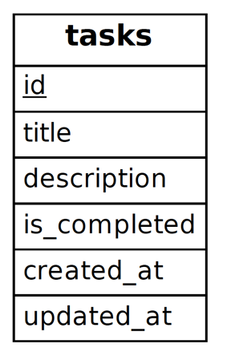
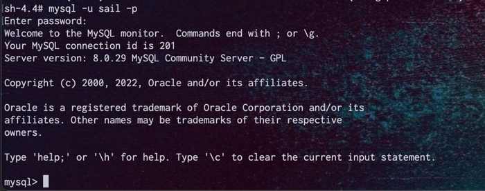

# DBにテーブルを作成する
マイグレーションはデータベースのバージョン管理のようなもので、チームがアプリケーションのデータベーススキーマを定義および共有できるようにします。  
https://readouble.com/laravel/9.x/ja/migrations.html

# migrationファイルの作成
Sailを起動しMigration Fileを作成しましょう。

ER図に沿って、tasksテーブルを追加します。  
  
Laravelでは、artisanコマンドを利用して様々な処理を実行できます。  
今回は、makeコマンドを利用して、migrationファイルを追加して見ましょう。
```
./vendor/bin/sail exec laravel.test php artisan make:migration create_tasks_table
```

./database/migrations に、Tasksテーブルが追加されてば成功です。  
create_xxxx_tableという命名にすることで、xxxxテーブルの新規追加Migrationファイルが作成されます。

# migrationファイルの編集
先ほど作成したファイルに項目を追加していきます。
id, created_at, updated_atは自動で追加されているので、残りの項目を追加していきましょう。

- title: varchar(255)
- description: varchar(1024)
- is_completed: tinyint(1)

まずは、作成されたmigration fileを開きましょう。
./database/migrations を確認してファイルを開いてください。

`title`と`description`は文字列型なので、stringメソッドを利用します。  
`id`のカラムの下に次の行を追加しましょう。
第1引数はカラム名、第2引数は文字数です。デフォルトは`255`なので`description`のみ指定しましょう  
```
$table->string('title');
$table->string('description', 1024);
```

次に、is_completedを追加します。  
これは状態を表現するため、`boolean`とします。
```
$table->boolean('is_completed')->default(0);
```

作成例は、./src/migrations/2022_09_17_073056_create_tasks_table.php になります。  
上手く作成できない場合は参考に読んで見てください。  


# migrationの実行
追加したMigrationは下記コマンドで実行されます。  
早速実行して正しく作成できるか試してみましょう。  
```
./vendor/bin/sail exec laravel.test php artisan migrate
```


# mysqlで確認
mysqlのDockerコンテナに入ってテーブルが追加されたか確認しましょう。
```
./vendor/bin/sail exec mysql sh
```
上記実行すると、`mysql`のコンテナ内にアクセスできます。  

ここから、mysqlコマンドを実行して見ましょう。
認証情報は、`.env`ファイルの下記を確認してください。
- DB_DATABASE
- DB_USERNAME
- DB_PASSWORD
```
mysql -u ${ユーザ名} -p
```


成功すると、図のように`mysql>`が表示されます。  
早速追加したテーブルを確認しましょう。  

```
show columns from ${DBの名前}.tasks;
```

  
図のようにカラムが追加されていたら成功です。  

一緒にmigrationの実行結果ログも確認しましょう。  
migrationは、テーブルに実行ファイル名が保存されています。  
```
select * from ${DBの名前}.migrations;
```
  
このテーブルを変更することで、migrationが実行されていない状態を作り出すことも可能です。  
※ これは破壊的な操作です。実行には十分注意してください。  

# おわりに
以上でmigration作成は終了です。  
続いてModel（Eloquent）の作成に移りましょう。  
