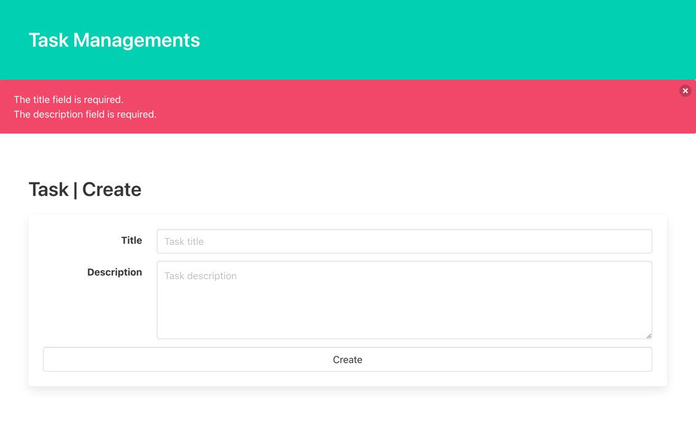

# はじめに  
これまでは、MigrationやModelなどLaravelの機能ごとの解説を行ってきました。  
下準備は一旦完了なので、REST設計に乗っ取ってCRUD処理を作成してみましょう。  
https://readouble.com/laravel/9.x/ja/controllers.html#actions-handled-by-resource-controller  
上を参考にTasksのリソース処理を作成していきましょう。

CRUDは以下の頭文字で、それに沿って開発を進めてみましょう。  
- Create
- Read
- Update
- Delete

# Controllerの作成
一般的なLaravel開発をする際、Routeingと処理を分割するためにControllerを作成します。  
プロジェクトによっては更に階層を細分化しますが、今回はControllerに全てのロジックを記載していきます。  
https://readouble.com/laravel/9.x/ja/controllers.html

下記コマンドで、Controllerを作成しましょう。
今回は、REST設計の乗っ取るため、`resource` オプションを利用します。
``` 
./vendor/bin/sail exec laravel.test php artisan make:controller TaskController --resource
```

成功すると、./app/Http/Controller/TaskController.php が作成されます。

# Routingの作成
次に、Endpointを作成します。  
既存ファイルの、./routes/web.php に記載しましょう。  
Creat画面と、Create処理のために2つのルーティングを追加しましょう。  
これにより、APIアクセスが可能になります。  
``` 
Route::get('tasks/create', [\App\Http\Controllers\TaskController::class, 'create'])->name('tasks.create');
Route::post('tasks', [\App\Http\Controllers\TaskController::class, 'store'])->name('tasks.store');
```
nameメソッドは、routingに名前をつけることができます。  
これを指定することで、route helperを利用して、route名でURLを生成することができるようになります。  

# Viewの作成
Create画面を作成しましょう。  
今回はJSを利用しないため、bladeというLaravelのテンプレートエンジンを利用しましょう。  
https://readouble.com/laravel/9.x/ja/blade.html  
なんと、pageの作成用のコマンドはありません。（componentはあるのに...）  

./resources/views/task/create.blade.php を手動で作成して下記をコピーしてください。  

```
<!DOCTYPE html>
<html lang="{{ str_replace('_', '-', app()->getLocale()) }}">
<head>
    <meta charset="utf-8">
    <title>Laravel</title>
    <link rel="stylesheet" href="https://cdn.jsdelivr.net/npm/bulma@0.9.4/css/bulma.min.css">
</head>
<body>
<section class="hero is-primary">
    <div class="hero-body">
        <p class="title">
            Task Managements
        </p>
    </div>
</section>
@if($errors->any())
    <div class="notification is-danger">
        <button class="delete"></button>
        <ul>
            @foreach(\Illuminate\Support\Arr::flatten($errors->get('*')) as $message)
                <li>{{ $message }}</li>
            @endforeach
        </ul>
    </div>
@endif
<section class="section">
    <h1 class="title">Task | Create</h1>
    <form method="post" action="{{ route('tasks.store') }}">
        @csrf
        <div class="card">
            <div class="card-content">
                <div class="field is-horizontal">
                    <div class="field-label is-normal">
                        <label class="label" for="title">Title</label>
                    </div>
                    <div class="field-body">
                        <div class="field">
                            <p class="control">
                                <input id="title" name="title" class="input" type="text" placeholder="Task title">
                            </p>
                        </div>
                    </div>
                </div>

                <div class="field is-horizontal">
                    <div class="field-label is-normal">
                        <label class="label" for="description">Description</label>
                    </div>
                    <div class="field-body">
                        <div class="field">
                            <div class="control">
                                <textarea id="description" name="description" class="textarea"
                                          placeholder="Task description"></textarea>
                            </div>
                        </div>
                    </div>
                </div>

                <div class="field is-horizontal">
                    <div class="field-label is-normal">
                        <label class="label" for="description">Complete?</label>
                    </div>
                    <div class="field-body">
                        <div class="field">
                            <div class="select">
                                <select name="is_completed" disabled>
                                    <option value="0">Yet</option>
                                    <option value="1">Done</option>
                                </select>
                            </div>
                        </div>
                    </div>
                </div>

                <footer class="card-footer">
                    <button type="submit" class="card-footer-item button">Create</button>
                </footer>
            </div>
        </div>
    </form>
</section>
</body>
</html>
```
CSS FWとしてBULMAを利用しています。  
HTMLやCSSの詳細は取り扱いませんので興味のある方は公式を確認してください。  
https://bulma.io/

# Controller@createの編集
TaskControllerに下記を追加してください。  
これにより、このエンドポイントにアクセスした場合は作成したViewが返却されるようになります。  
```
public function create()
{
    return view('task/create');
}
```

さて、ここまでの実装で、画面が確認できるようになりました。  
早速アクセスして見ましょう。  
[タスク作成画面](http://localhost/tasks/create)  


# FormRequestの作成
次に保存処理を作成しましょう。  
Laravelでは、Controllerに入る前にFormRequest内でValidationを行うことができます。  
早速作成していきましょう。  
``` 
./vendor/bin/sail exec laravel.test php artisan make:request Task/StoreRequest
```
./app/Http/Requests/Task/StoreRequest.php が作成されるので確認しましょう。

validationルールを設定する前に、まずは下記のように、`return true`に変更してください。
Request単位で個別に認証することが可能です。
こちらがfalseの場合、認証失敗扱いとなります。
``` 
public function authorize()
{
    return true;
}
```

# Validation Ruleの作成
ValidationRuleは下記を参照してください。  
https://readouble.com/laravel/9.x/ja/validation.html  

今回は、DBの設計に合わせて、titleとdescriptionの2つにRuleを設定します。
``` 
return [
    'title' => ['required', 'string', 'max:255'],
    'description' => ['required', 'string', 'max:1024'],
];
```
Laravelには多くのバリデーションが実装されています。  
要件に合わせて組み合わせ利用していきましょう。  

# Controller@storeの作成
## FormRequestのInjection
先ほど作成した、StoreRequestをControllerのメソッドに対して`Dependency Injection`します。  
StoreRequestの実行パスは必ずuseしてください。
この状態にすることで、Controllerのアクションが実行されるタイミングで、FormValidationが実行されます。  
``` 
public function store(StoreRequest $request)
```
上記が設定できたら、タスク作成画面に遷移して空のままCreateを押下して見ましょう。  
これによりバリデーションエラーが正しく表示されることを確認してください。  
[タスク作成画面](http://localhost/tasks/create)  
  

## DBへの登録処理
Laravelでは、Eloquent経由で簡単にDB登録することができます。  
下記を参考にコードを記載してください。  
```
public function store(StoreRequest $request)
{
    $task = DB::transaction(function () use ($request) {
        return Task::create($request->validated());
    });

    return response()->json($task);
}
```

このコードでは下記を行っています。  
1. DB transactionの開始
2. クロージャー内で、Eloquentを利用してレコードCreateを実行
3. $request->validated()は、取得したFormRequestのValidationRuleを通過したパラメータのみを返却します。  
4. 実行結果を$taskに格納
5. 暫定処理として、jsonとしてresponseを作成

このコードを設定したら、画面からTitleとDescriptionを設定してタスク登録を行ってください。  
[タスク作成画面](http://localhost/tasks/create)  
  
この画面は、ChromeのPluginによってフォーマッタされた状態で表示されています。  
Simpleなテキストで、登録結果が表示されていれば成功です。  

# おわりに
この章では、Laravelのcreate/store処理を実装しました。  
次の章ではこの作成したデータを確認できるように、Read処理としてindex/showを作成していきます。  

