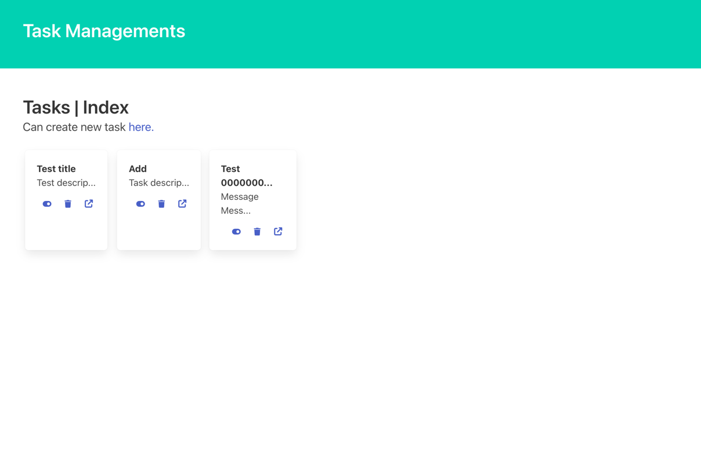
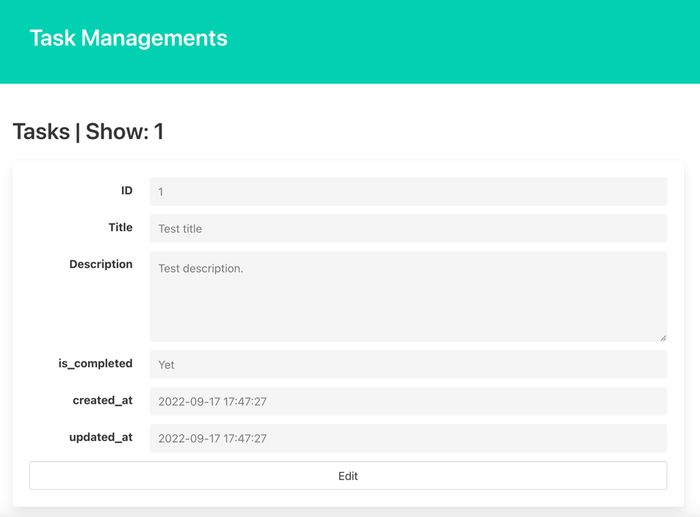

# はじめに  
この章では、Read処理として、indexとshowを作成していきましょう。  
これらはそれぞれ下記目的で作成されます。
- index: リソースのリストページ
- show: 単体リソースの詳細ページ

# Routingの作成
Restfull設計に沿って、indexとshow用のルーティングを定義します。  
```
Route::get('tasks', [\App\Http\Controllers\TaskController::class, 'index'])->name('tasks.index');
Route::get('tasks/{task}', [\App\Http\Controllers\TaskController::class, 'show'])->name('tasks.show');
```

show側ですが、{task}はルートパラメータです。  
ここで指定した命名で、Controller側の引数として依存性注入されます。  

# Controllerの作成
## index
こちらではTaskのリストを取得してViewを返却します。  
Taskモデルに、QueryBuilder関連のメソッドにstaticアクセスすることで、QueryBuildが生成されます。  
今回の例では、`完了ステータス`、 `ID`の順にソートしてgetで取得してまいます。  

また、取得したデータは、withで受け渡すことにより、Viewのレンダリング時に利用することができます。  
```
public function index()
{
    $tasks = Task::orderBy('is_completed')
        ->orderBy('id')
        ->get();

    return view('task.index')->with(compact('tasks'));
}
```
※ compactは、変数名と同一のkeyを持った配列を生成します。今回は['tasks' => $task]と同義です。  
https://www.php.net/manual/ja/function.compact.php  

## show
こちらでは単一のタスクを取得してViewに返却します。  
取得処理がありませんね？  
TaskというEloquentモデルを指定することで、依存関係の自動注入が発生します。  
この時、指定ModelのPKに対してルートパラメータで検索が実施されます。  
https://readouble.com/laravel/9.x/ja/container.html

存在しないデータを指定した場合は、404エラーが発生します。  

``` 
public function show(Task $task)
{
    return view('task.show')->with(compact('task'));
}
```

## store
先ほどは、json形式でレスポンスを作成していましたが、indexが作成されたのでRedirectを設定しましょう。  
``` 
public function store(StoreRequest $request)
{
    $task = DB::transaction(fn() => Task::create($request->validated()));

    return to_route('tasks.index');
}
```

# viewの作成
indexと、showのviewを作成します。  
createと同様にbladeファイルを作成しましょう。
Laravelの機能に関する説明のため、Viewに関しては名言しません。  

## index

``` 
<!DOCTYPE html>
<html lang="{{ str_replace('_', '-', app()->getLocale()) }}">
<head>
    <meta charset="utf-8">
    <title>Laravel</title>
    <link rel="stylesheet" href="https://cdn.jsdelivr.net/npm/bulma@0.9.4/css/bulma.min.css">
    <link rel="stylesheet" href="https://cdnjs.cloudflare.com/ajax/libs/font-awesome/6.2.0/css/all.min.css">
</head>
<body>
<section class="hero is-primary">
    <div class="hero-body">
        <p class="title">
            Task Managements
        </p>
    </div>
</section>
@if($errors->any())
    <div class="notification is-danger">
        <button class="delete"></button>
        <ul>
            @foreach(\Illuminate\Support\Arr::flatten($errors->get('*')) as $message)
                <li>{{ $message }}</li>
            @endforeach
        </ul>
    </div>
@endif
<section class="section">
    <h1 class="title">Tasks | Index</h1>
    <h2 class="subtitle">Can create new task <a href="{{ route('tasks.create') }}">here.</a></h2>
    <div class="tile">
        @foreach($tasks as $task)
            <div class="tile is-1" style="margin: 4px">
                <div class="box @if($task->is_completed) has-background-grey-lighter @endif">
                    <article class="media">
                        <div class="media-content">
                            <div class="content">
                                <p>
                                    <strong>{{ mb_strimwidth($task->title, 0, 15, '...') }}</strong>
                                    <br>
                                    {{ mb_strimwidth($task->description, 0, 15, '...') }}
                                </p>
                            </div>

                            <nav class="level">
                                <div class="level-left">
                                </div>
                                <div class="level-right">
                                    @if($task->is_completed)
                                        <div class="level-item">
                                            <form>
                                                @csrf
                                                @method('PATCH')
                                                <span class="icon">
                                                <button type="submit" class="has-text-link is-clickable"
                                                        style="background: none; border: unset">
                                                    <i class="fa-solid fa-toggle-off"></i>
                                                </button>
                                            </span>
                                            </form>
                                        </div>
                                    @else
                                        <div class="level-item">
                                            <form>
                                                @csrf
                                                @method('PATCH')
                                                <span class="icon">
                                                <button type="submit" class="has-text-link is-clickable"
                                                        style="background: none; border: unset">
                                                    <i class="fa-solid fa-toggle-on"></i>
                                                </button>
                                            </span>
                                            </form>
                                        </div>
                                    @endif

                                    <div class="level-item">
                                        <form>
                                            @csrf
                                            @method('DELETE')
                                            <span class="icon">
                                                <button type="submit" class="has-text-link is-clickable"
                                                        style="background: none; border: unset">
                                                    <i class="fa-solid fa-trash"></i>
                                                </button>
                                            </span>
                                        </form>
                                    </div>
                                    <div class="level-item">
                                        <a href="{{ route('tasks.show', $task) }}">
                                            <span class="icon">
                                                <i class="fa-solid fa-arrow-up-right-from-square"></i>
                                            </span>
                                        </a>
                                    </div>
                                </div>
                            </nav>
                        </div>
                    </article>
                </div>
            </div>
        @endforeach
    </div>
</section>
</body>
</html>
```

## show

```
<!DOCTYPE html>
<html lang="{{ str_replace('_', '-', app()->getLocale()) }}">
<head>
    <meta charset="utf-8">
    <title>Laravel</title>
    <link rel="stylesheet" href="https://cdn.jsdelivr.net/npm/bulma@0.9.4/css/bulma.min.css">
</head>
<body>
<section class="hero is-primary">
    <div class="hero-body">
        <p class="title">
            Task Managements
        </p>
    </div>
</section>
@if($errors->any())
    <div class="notification is-danger">
        <button class="delete"></button>
        <ul>
            @foreach(\Illuminate\Support\Arr::flatten($errors->get('*')) as $message)
                <li>{{ $message }}</li>
            @endforeach
        </ul>
    </div>
@endif
<section class="section">
    <h1 class="title">Tasks | Show: {{ $task->id }}</h1>
    <div class="card">
        <div class="card-content">
            <div class="field is-horizontal">
                <div class="field-label is-normal">
                    <label class="label">ID</label>
                </div>
                <div class="field-body">
                    <div class="field">
                        <p class="control">
                            <input class="input" type="text" value="{{ $task->id }}" disabled>
                        </p>
                    </div>
                </div>
            </div>

            <div class="field is-horizontal">
                <div class="field-label is-normal">
                    <label class="label">Title</label>
                </div>
                <div class="field-body">
                    <div class="field">
                        <p class="control">
                            <input class="input" type="text" value="{{ $task->title }}" disabled>
                        </p>
                    </div>
                </div>
            </div>

            <div class="field is-horizontal">
                <div class="field-label is-normal">
                    <label class="label">Description</label>
                </div>
                <div class="field-body">
                    <div class="field">
                        <div class="control">
                            <textarea class="textarea" disabled>{{ $task->description }}</textarea>
                        </div>
                    </div>
                </div>
            </div>

            <div class="field is-horizontal">
                <div class="field-label is-normal">
                    <label class="label">is_completed</label>
                </div>
                <div class="field-body">
                    <div class="field">
                        <p class="control">
                            <input class="input" type="text" value="{{ $task->is_completed ? 'Done' : 'Yet' }}" disabled>
                        </p>
                    </div>
                </div>
            </div>

            <div class="field is-horizontal">
                <div class="field-label is-normal">
                    <label class="label">created_at</label>
                </div>
                <div class="field-body">
                    <div class="field">
                        <p class="control">
                            <input class="input" type="text" value="{{ $task->created_at }}" disabled>
                        </p>
                    </div>
                </div>
            </div>

            <div class="field is-horizontal">
                <div class="field-label is-normal">
                    <label class="label">updated_at</label>
                </div>
                <div class="field-body">
                    <div class="field">
                        <p class="control">
                            <input class="input" type="text" value="{{ $task->updated_at }}" disabled>
                        </p>
                    </div>
                </div>
            </div>

            <footer class="card-footer">
                <a class="card-footer-item button" href="">
                    Edit
                </a>
            </footer>
        </div>
    </div>
</section>
</body>
</html>
```

## おわりに
これで、Read処理が完成しました。  
create -> index -> showの順番で画面遷移を体験して見ましょう。  
次は、Updateを見ていきます。  
- 全体更新: Put
- 部分更新: Patch
の使い分けを確認します。  
