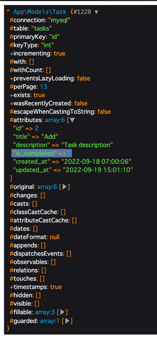

# はじめに  
この章では、Update処理として、editとupdate、そしてcomplete(yetComplete)メソッドを作成していきましょう。  
これらはそれぞれ下記目的で作成されます。
- edit: 更新画面の表示
- update: 更新処理の実施
- complete: is_completedをtrueに更新を実装
- yetComplete: is_completedをfalseに更新を実装

# Routingの作成
Restfull設計に沿って、editとupdate用のルーティングを定義します。  
```
Route::get('tasks/{task}/edit', [\App\Http\Controllers\TaskController::class, 'edit'])->name('tasks.edit');
Route::put('tasks/{task}', [\App\Http\Controllers\TaskController::class, 'update'])->name('tasks.update');
```
complete(yetComplete)は、Restfull設計から逸脱するため別途作成します。

# Requestの作成
Update用にRequestを作成しましょう。  
下記コマンドで該当ファイルを作成してください。  
``` 
./vendor/bin/sail exec laravel.test php artisan make:request Task/UpdateRequest
```

更新画面でも、完了状態の管理は無効となっているためStore時と対象項目は変わりません。  
StoreRequestを参考にFormValidationを完成させてください。  

# Controllerの作成
## edit 
ここの処理は、showメソッドとほぼ同一となります。  
実装例はsrc以下に記載してありますが、まずは自分で実装して見ましょう。

## update
updateはEloquentModelからupdateメソッドを呼び出す事で実装できます。  
更新に失敗する可能性に備えて、必ずTransactionを実行しましょう。
```
public function update(UpdateRequest $request, Task $task)
{
    DB::transaction(fn() => $task->update($request->validated()));

    return response()->redirectToRoute('tasks.index');
}
```

# viewの作成
edit画面を作成します。  
また、showからeditへの遷移がまだ実現できていないため遷移できるようにコードを修正しましょう。  

## edit 

``` 
<!DOCTYPE html>
<html lang="{{ str_replace('_', '-', app()->getLocale()) }}">
<head>
    <meta charset="utf-8">
    <title>Laravel</title>
    <link rel="stylesheet" href="https://cdn.jsdelivr.net/npm/bulma@0.9.4/css/bulma.min.css">
</head>
<body>
<section class="hero is-primary">
    <div class="hero-body">
        <p class="title">
            Task Managements
        </p>
    </div>
</section>
@if($errors->any())
    <div class="notification is-danger">
        <button class="delete"></button>
        <ul>
            @foreach(\Illuminate\Support\Arr::flatten($errors->get('*')) as $message)
                <li>{{ $message }}</li>
            @endforeach
        </ul>
    </div>
@endif
<section class="section">
    <h1 class="title">Tasks | Edit: {{ $task->id }}</h1>
    <form method="post" action="{{ route('tasks.update', $task) }}">
        @csrf
        @method('put')
        <div class="card">
            <div class="card-content">
                <div class="field is-horizontal">
                    <div class="field-label is-normal">
                        <label class="label">ID</label>
                    </div>
                    <div class="field-body">
                        <div class="field">
                            <p class="control">
                                <input class="input" type="text" value="{{ $task->id }}" disabled>
                            </p>
                        </div>
                    </div>
                </div>

                <div class="field is-horizontal">
                    <div class="field-label is-normal">
                        <label class="label" for="title">Title</label>
                    </div>
                    <div class="field-body">
                        <div class="field">
                            <p class="control">
                                <input id="title" name="title" class="input" type="text" value="{{ $task->title }}">
                            </p>
                        </div>
                    </div>
                </div>

                <div class="field is-horizontal">
                    <div class="field-label is-normal">
                        <label class="label" for="description">Description</label>
                    </div>
                    <div class="field-body">
                        <div class="field">
                            <div class="control">
                                <textarea id="description" name="description" class="textarea">{{ $task->description }}</textarea>
                            </div>
                        </div>
                    </div>
                </div>

                <div class="field is-horizontal">
                    <div class="field-label is-normal">
                        <label class="label">is_completed</label>
                    </div>
                    <div class="field-body">
                        <div class="field">
                            <p class="control">
                                <input class="input" type="text" value="{{ $task->is_completed ? 'Done' : 'Yet' }}"
                                       disabled>
                            </p>
                        </div>
                    </div>
                </div>

                <div class="field is-horizontal">
                    <div class="field-label is-normal">
                        <label class="label">created_at</label>
                    </div>
                    <div class="field-body">
                        <div class="field">
                            <p class="control">
                                <input class="input" type="text" value="{{ $task->created_at }}" disabled>
                            </p>
                        </div>
                    </div>
                </div>

                <div class="field is-horizontal">
                    <div class="field-label is-normal">
                        <label class="label">updated_at</label>
                    </div>
                    <div class="field-body">
                        <div class="field">
                            <p class="control">
                                <input class="input" type="text" value="{{ $task->updated_at }}" disabled>
                            </p>
                        </div>
                    </div>
                </div>

                <footer class="card-footer">
                    <button type="submit" class="card-footer-item button is-primary">
                        update
                    </button>
                </footer>
            </div>
        </div>
    </form>
</section>
</body>
</html>
```

## show
editへ遷移できるようにリンクを修正しましょう。

# Update処理の実装完了
ここまでの処理が正しく実装できて入れば下記の流れを体験できます。   
`index -> show -> edit -> update -> index.`  

実際に画面を触って上記動作が正しく実現できていることを確認してください。  

# 完了状態の変更処理実装
ここからは完了状態に変更できるように実装を行います。  
今回作成するメソッドは、Restfull設計に存在しない独自の処理となります。  
業務ではこうした小さい更新を行うシーンがいくつもでてきます。  
要件にあった処理を考え実装していきましょう。

# CompleteのRouting実装
一部のリソースのみ変更するため、今回はpatchメソッドを利用します。  
特定の項目のみ更新する場合はpatch処理を利用しましょう。  
``` 
Route::patch('tasks/{task}/complete', [\App\Http\Controllers\TaskController::class, 'complete'])->name('tasks.complete');
Route::patch('tasks/{task}/yet_complete', [\App\Http\Controllers\TaskController::class, 'yetComplete'])->name('tasks.yet_complete');
```

# CompleteのController処理
固定値でステータス変更を行うため、Validationは必要ありません。
下記2つのメソッドを追加してみてください。
``` 
public function complete(Task $task): RedirectResponse
{
    DB::transaction(fn() => $task->update(['is_completed' => true]));

    return response()->redirectToRoute('tasks.index');
}

public function yetComplete(Task $task): RedirectResponse
{
    DB::transaction(fn() => $task->update(['is_completed' => false]));

    return response()->redirectToRoute('tasks.index');
}
```

# Viewの修正
該当箇所を修正して、それぞれのメソッドを実行するように修正しましょう
``` 
@if($task->is_completed)
    <div class="level-item">
        <form method="post" action="{{ route('tasks.yet_complete', $task) }}">
            @csrf
            @method('PATCH')
            <span class="icon">
            <button type="submit" class="has-text-link is-clickable"
                    style="background: none; border: unset">
                <i class="fa-solid fa-toggle-off"></i>
            </button>
        </span>
        </form>
    </div>
@else
    <div class="level-item">
        <form method="post" action="{{ route('tasks.complete', $task) }}">
            @csrf
            @method('PATCH')
            <span class="icon">
            <button type="submit" class="has-text-link is-clickable"
                    style="background: none; border: unset">
                <i class="fa-solid fa-toggle-on"></i>
            </button>
        </span>
        </form>
    </div>
@endif
```

# 実装を終えて?
さて、これで一通りの実装が完了しました。  
トグルのiconをクリックするとステータスは変更できたでしょうか？  

恐らく上手く更新できていないかと思います。  
では、どうするか？  
デバック機能を利用して見ましょう！

Controllerのcompleteメソッドで、update実行後に`dd($task)`を追加してみてください。  
この状態で実行する事で、該当箇所で処理を中断して変数のdump情報が確認できます。  
``` 
public function complete(Task $task): RedirectResponse
{
    DB::transaction(fn() => $task->update(['is_completed' => true]));
    dd($task);

    return response()->redirectToRoute('tasks.index');
}
```
`attributes`を展開して中を確認して見ましょう。  
おや？is_completedを`true`に更新したのに、0のままですね？  



.....なるほど！これは$fillableの設定ミスですね。  
Taskモデルの$fillableを正しく修正してみましょう！  

いかがですか？今度は正しく更新されるようになりましたか？  
おめでとう！今度こそ完了です。

# おわりに
この章では、Update処理とDebug処理について学んできました。  
$fillableの設定ミスは実際の開発でも良く発生する問題です。  
想定外の問題が起きた時は、落ち着いてデータがどうなっているか確認しましょう。  

この課題も残すところ、Delete処理のみです。
是非、最後まで進めてください。  
