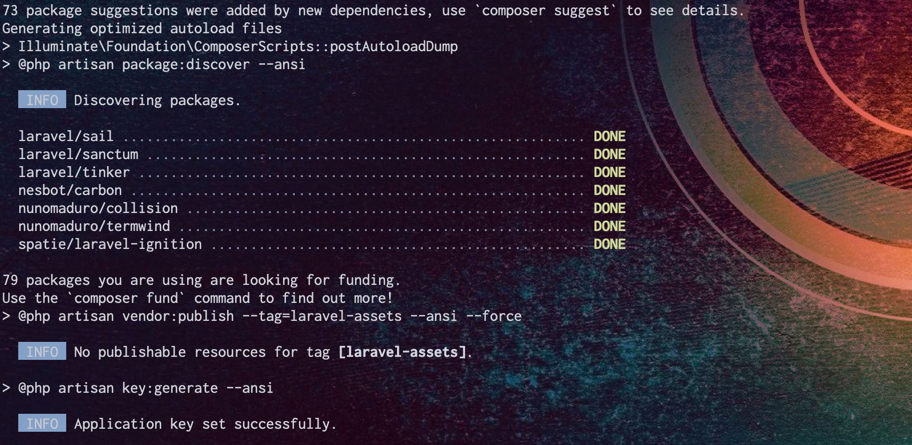
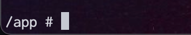
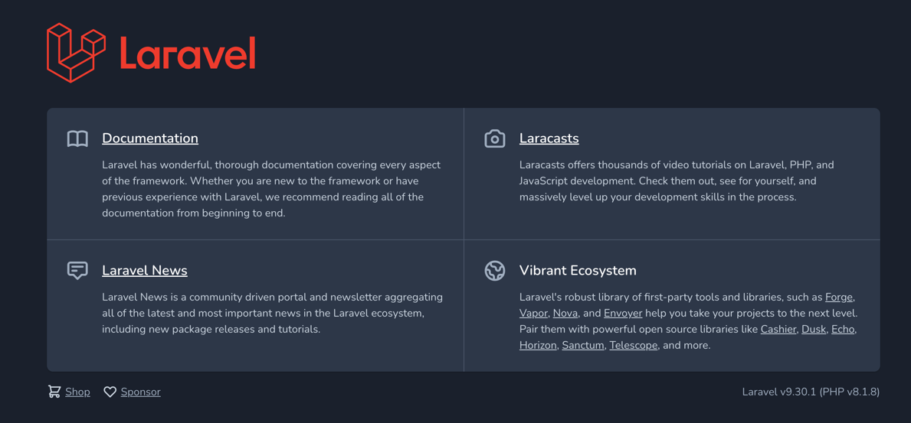

# Getting Started
Finally, we will create a Laravel project.  
In challenge, it is recommended to prepare a new Git Repository each time you create a new project, as you will be writing code in the initial project you are creating this time.  
We recommend you to create a new Git Repository for each challenge.

# Create a Git Repository
If you don't need such a thing! You can skip this if you think "I don't need that!  
If you are going to develop multiple projects in the future, it is recommended that you split up the directories at least.  
You can create a Git Repository any way you want.  
If you want to share your code with others, we recommend using a service such as GitHub.  
After creating a Repository with the service, git clone it to your environment.

```
git clone ${your repository}
```

# Create a Laravel project
From here, we will perform the basic operations using the CLI (Terminal).  
You can change the commands to suit your environment.  

Go to the repository you git cloned from.  
```
cd ${your repository}
```

Now it's time to create your Laravel project!  
Since laravel cannot be installed directly under a directory, create a project with the name `temp` and move the files.  
If you don't need to move files, you can create a project with a nice name.
Install Laravel below.  
Laravel is installed using a php file management system called `composer`.  
This time, we will not install `composer` in our own environment, but perform the installation via Docker.  
```
docker run -v ${PWD}:/app --rm composer create-project laravel/laravel temp
```

The installation is complete when the ApplicationKey for Laravel is even generated.  
From here, proceed with the Sail configuration.


# Configure Sail
From here, you will need to configure it interactively, so connect inside the composer Docker container.
```
docker run -v ${PWD}:/app -it composer sh
```
After running the above, you will be connected to the Docker container.  


From here, you can set up Sail.  
Run the following and select mysql as the DB. (This is just an example. You can choose any DB you like.)  
```
php temp/artisan sail:install
[select mysql]
```

You are now done, let's go outside of Docker.
```
exit
```

# Move directories
Do you like the air outside the Docker container?  
From here, we will move the Laravel Project directly under Direct.  
If you don't want to change the configuration, skip this section.  

After moving all the files with the mv command, delete the temp directory.
```
mv ./temp/.* ./
mv ./temp/* ./
rmdir ./temp
```

# Start Sail
Let's start Sail by executing the following.
```
./vendor/bin/sail up
```
[Confirmation of startup](http://localhost)  



# Conclusion
Your first Laravel project is now a great success! Congratulations!  
From here, let's move on to the challenge and start learning Laravel immediately.  

Don't know the Sail command?  
For those of you who don't, you can use `./tool/Makefile` for those who do.  
If you enable the make file, simple commands are registered and you can use them as shortcuts. 

ex)  

| command  | remark                       |
|----------|------------------------------|
| sail-upd | sail in the weak up          |
| sail-upd | run sail in the background   |
| sail-upd | stop background running sail |
