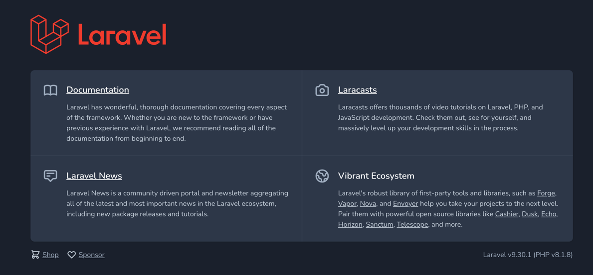

# はじめに
いよいよ、Laravelのプロジェクトを作成します。  
challengeでは、今回作成する初期状態のプロジェクトにコードを記載していくため、  
都度、新しいGit Repositoryを用意する事をお勧めします。  

# Git Repositoryの作成
そんなものは必要ない！という方は読み飛ばしていただいても問題ありません。  
今後、複数のプロジェクト開発にあたりディレクトリだけでも分割することをお勧めします。  
Git Repositoryはどのように作成しても構いません。  
もし、作成したコードを誰かに共有したいのであれば、GitHubなどのサービスを利用することをお勧めします。  
サービスでRepositoryを作成した後に、自身の環境にgit cloneしてきてください。

```
git clone ${あなたのリポジトリ}
```

# Laravelプロジェクトの作成
ここからは基本に操作をCLI（ターミナル）で実行していきます。  
あなたの環境に合わせて適宜読み替えながらコマンドを実行してください。  

git cloneしてきたリポジトリの中に移動します。  
```
cd ${あなたのリポジトリ}
```

いよいよLaravelプロジェクトを作成します！！  
laravelはディレクトリ直下にインストールすることができないため、`temp`の名前でプロジェクトを作成し、ファイルを移動します。  
ファイルの移動が必要ない人は、素敵な名前のプロジェクトを作成してあげてください。
下記で、Laravelをインストールします。  
laravelは、`composer`というphpのファイルマネージメントシステムを利用してインストールします。  
今回は、自身の環境に`composer`をインストールせず、Docker経由でインストールを実行します。  
```
docker run -v ${PWD}:/app --rm composer create-project laravel/laravel temp
```

LaravelのApplicationKeyまで生成されたらインストール完了です。  
ここから、Sailの設定を進めていきます。


# Sailの設定
ここからは対話形式で設定する必要が出るため、composerのDockerコンテナ内に接続します。
```
docker run -v ${PWD}:/app -it composer sh
```
上記実行後、Dockerコンテナ内に接続されます。  


ここから、Sailのセットアップを行います。  
下記を実行して、DBはmysqlを選択してください。（あくまで一例です。あなたの好きなDBを選択してください。）  
```
php temp/artisan sail:install
[mysql選択]
```

これにて完了です。Dockerの外にでましょう。
```
exit
```

# ディレクトリを移動
Dockerコンテナの外の空気はおいしいですか？  
ここからは、Direct直下にLaravel Projectの移動を行います。  
構成を変えたくない人は読み飛ばしてください。  

mvコマンドで全てのファイルを移動した後に、tempディレクトを削除します。
```
mv ./temp/.* ./
mv ./temp/* ./
rmdir ./temp
```

# Sailの起動
下記を実行してSailを起動して見ましょう。
```
./vendor/bin/sail up
```
[起動確認](http://localhost)  



# おわりに
はじめてのLaravelプロジェクト作成は、これにて大成功！おめでとう！！  
ここから、チャレンジに進んで早速Laravelの勉強を始めましょう。  

え？Sailのコマンドがわからない？  
そんな人のために、`./tool/Makefile`を用意しました。  
makeファイルを有効にしてもらえれば簡単なコマンドは登録してあるのでショートカットとして利用できます。 

ex)  

| command   | remark               |
|-----------|----------------------|
| sail-up   | sailを起動              |
| sail-upd  | sailをバックグラウンド実行      |
| sail-down | バックグラウンド実行されたSailを終了 |
